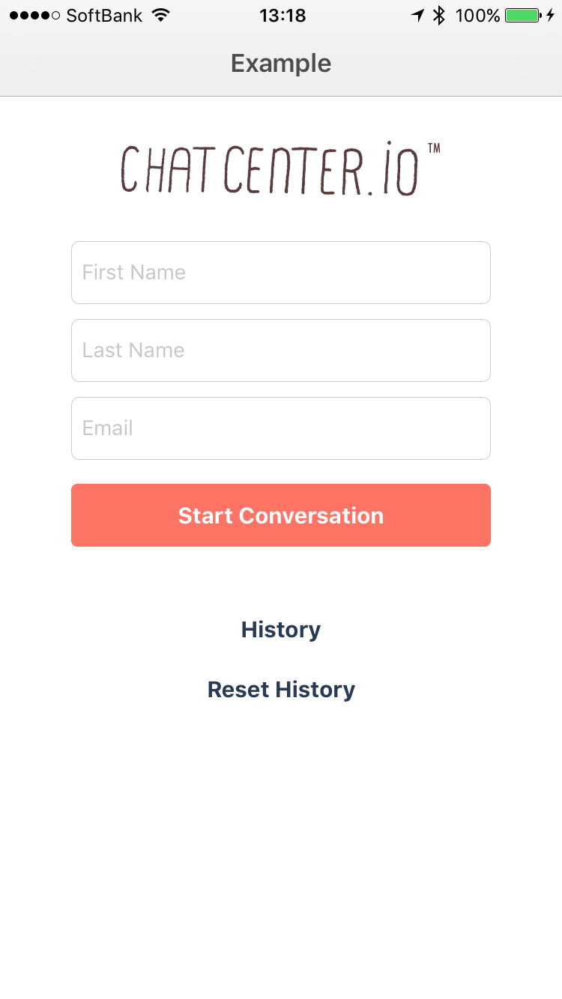
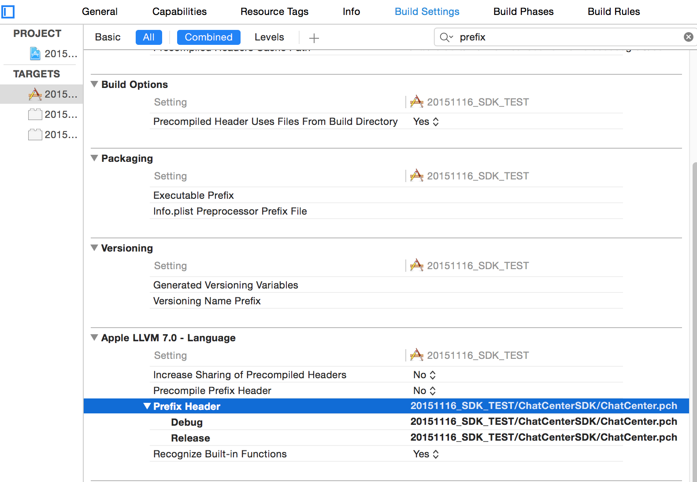
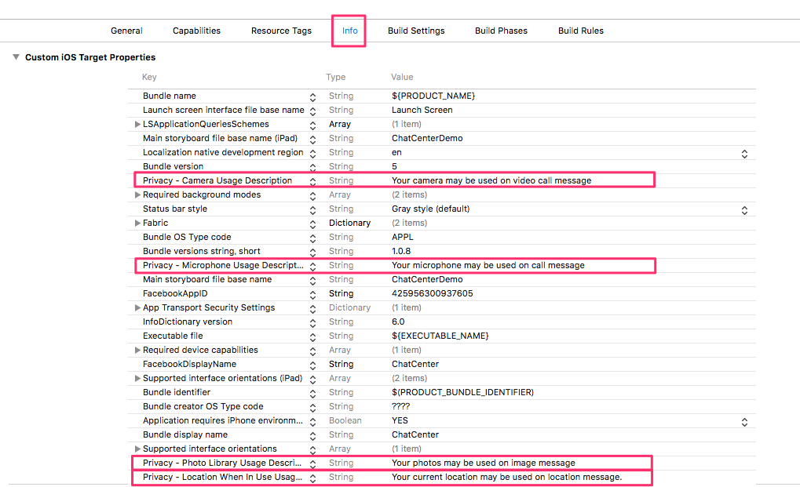
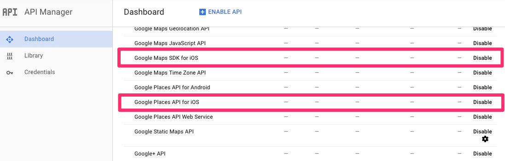
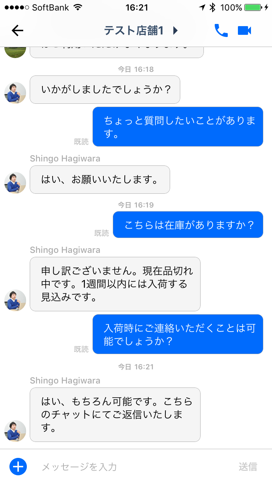
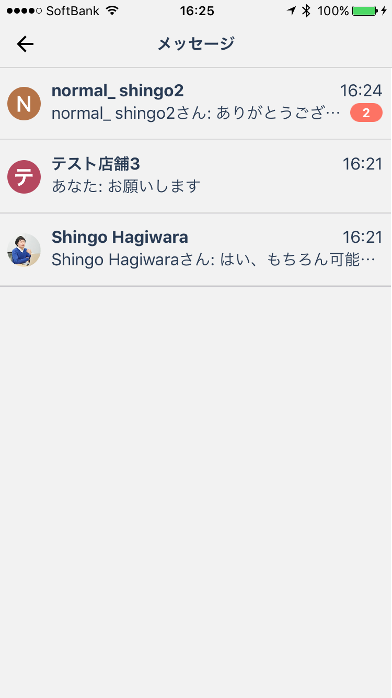
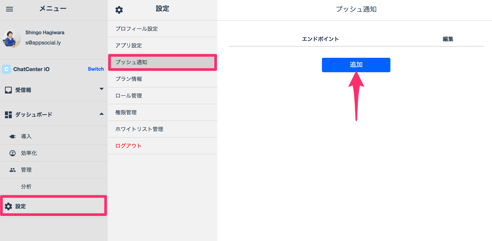

# ChatCenteriO iOS SDKインストールガイド Ver. 1.1.2

## 目次
* [Getting Started](#GettingStarted)
	* [1. サンプルプロジェクトをダウンロード](#DLSample)
	* [2. Pod install](#PodInstall)
	* [3. アプリケーションを起動](#LaunchApp)
* [SDKをアプリに組み込む](#InstallYourApp)
	* [1. Xcodeでの設定](#SettingOfXcode)
	* [2. App Tokenのセット](#SetAppToken)
	* [3. Google APIキーのセット](#SetGoogleAPIKey)
    * [4. チャットビューの呼び出し](#DispalyChatView)
    * [5. ヒストリービューの呼び出し](#DispalyHistoryView)
    * [6. ユーザーのログアウト](#LogoutUser)
* [オプション](#Opptions)
    * [1. プッシュ通知](#Pushnotification)
    * [2. デザインのカスタマイズ](#DesignCustom)
    * [3. 未読メッセージ数の取得](#ConfirmMessage)
    * [4. Orgのオンライン/オフラインの取得](#GetOnline/Offline)

<a id="GettingStarted"></a>
## Getting Started

<a id="DLSample"></a>
#### 1. サンプルプロジェクトをダウンロード
[こちら](https://github.com/chatcenter/ios/releases)よりChatCenterSDKをダウンロードします。
Exampleプロジェクトが含まれています。

<a id="PodInstall"></a>
#### 2. Pod install
Exampleフォルダにてpod installを実行してください

<a id="LaunchApp"></a>
#### 3. アプリケーションを起動
<p align="center"></p>

<a id="InstallYourApp"></a>
## SDKをアプリに組み込む

<a id="SettingOfXcode"></a>
### 1. Xcodeでの設定

<a id="1InstallSDK"></a>
#### 1-1. SDKのインストール
以下の(a)、(b)いづれかの方法をお選びください。
#### (a)Cocoa Podよりインストール
ご使用のPodfileに以下を追加してください(OpenTokはChatCenterSDK内で使用しているボイス/ビデオチャットのライブラリです)。
```
例)
target 'TargetName' do
pod 'ChatCenterSDK', :git => "https://github.com/chatcenter/ios.git"
pod 'OpenTok'
pod 'GoogleMaps'
pod 'GooglePlaces'
pod 'GooglePlacePicker'
end
```

該当のフォルダにてpod installを実施してください。
```
例)
pod install
```

#### (b)ソースからインストール
**ソースのダウンロード**  
[こちら](https://github.com/chatcenter/ios/releases)よりChatCenterSDKをダウンロードします。  
ChatCenterSDKフォルダを任意のフォルダへドラッグアンドドロップしてください。  

**ライブラリの追加**  
下記ライブラリを”Build Phases” > ”Link Binary With Libraries”より追加してください。  

* UIKit.framework
* CoreGraphics.framework
* AudioToolbox.framework
* QuartzCore.framework
* CFNetwork.framework 
* Security.framework 
* Foundation.framework
* CoreData.framework
* SystemConfiguration.framework
* MobileCoreServices.framework
* libicucore.A.tbdもしくはlibicucore.dylib
* MapKit.framework
* AssetsLibrary.framework
* SafariServices.framework(Optional)  

**PCHファイルへのパス追加**  
ChatCenterSDK内にPCHファイルがありますのでパスを通してください。
下図のように、プロジェクト > Build Settings > Apple LLVM 7.0 - Language > Prefix Headerに”(プロジェクト以下のパス)/ChatCenterSDK/ChatCenter.pch”と指定してください。
<p align="center"></p>

**OpenTok/Google Mapsライブラリの追加**  
OpenTokはChatCenterSDK内で使用しているボイス/ビデオチャットのライブラリです。  
ご使用のPodfileに以下を追加してください。  

```
例)
target 'TargetName' do
pod 'OpenTok'
pod 'GoogleMaps'
pod 'GooglePlaces'
pod 'GooglePlacePicker'
end
```

該当のフォルダにてpod installを実施してください。
```
例)
pod install
```

***

<a id="4EditPlist"></a>
#### 1-2. Plistの編集
ChatCenter SDKでは各ウィジェットの送信時に、ユーザーの情報を使用する場合があります。そのためplistに許諾の設定をお願いします。
許諾の必要があるものは以下です。

| 許諾項目|使用するウィジェット| 
|:-----------|:------------|
| NSLocationWhenInUseUsageDescription|位置情報|
| NSPhotoLibraryUsageDescription|画像添付|
| NSCameraUsageDescription|画像添付/ビデオチャット|
| NSMicrophoneUsageDescription|ビデオチャット/ボイスチャット|

<p align="center"></p>
ソースでは以下のようになります。

```
例)
<key>NSLocationWhenInUseUsageDescription</key>
<string>位置情報を送信時に使用します。</string>
<key>NSPhotoLibraryUsageDescription</key>
<string>画像を保存するためにアクセスします</string>
<key>NSCameraUsageDescription</key>
<string>ビデオチャットにて使用するためにアクセスします</string>
<key>NSMicrophoneUsageDescription</key>
<string>ビデオチャットにて使用するためにアクセスします</string>
```
***

<a id="5Localize"></a>
#### 1-3. 言語のローカライズ
各言語のstringファイルを用意しておりますので、各lprojフォルダにstringファイルをコピーしてください。もしlprojフォルダが存在しない場合は、lprojフォルダごとコピーしてください。

```
例)
ja.lproj/ChatCenterSDK.strings
en.lproj/ChatCenterSDK.strings
```

<a id="SetAppToken"></a>
## 2. App Tokenのセット
以下のメソッドを初回起動時のviewControllerのviewDidLoad等に箇所に挿入ください。  
```+ (void)setAppToken:(NSString *)appToken completionHandler:(void (^)(void))completionHandler;```

```
例)
#import "ChatCenter.h"

- (void)viewDidLoad
{
    [ChatCenter setAppToken:@”appsociallyより発行いたします” completionHandler:^{
       ///セット完了のコールバックです
       ///SDKのデザインカスタマイズはここに記述してください
    }];
  …
  …    
}
```
***

<a id="SetGoogleAPIKey"></a>
## 3. Google APIキーのセット
ChatCenterSDKではGoogleMapSDKを使用しています。そのため、Google APIのダッシュボードよりAPIキーを取得し、以下のようにdidFinishLaunchingWithOptionsにてセットをお願いします。<br>

```
例)
#import <GoogleMaps/GoogleMaps.h>
#import <GooglePlaces/GooglePlaces.h>
#import "ChatCenter.h"

- (BOOL)application:(UIApplication *)application didFinishLaunchingWithOptions:(NSDictionary *)launchOptions
{
…

[GMSServices provideAPIKey:"APIキーをセットください"];
[GMSPlacesClient provideAPIKey:"APIキーをセットください"];
[ChatCenter setGoogleApiKey:"APIキーをセットください"];

…
}
```

またGoogle APIのダッシュボードにて、Google Maps SDK for iOSおよびGoogle Places API for iOSが有効になっていることをご確認ください。
<p align="center"></p>
***

<a id="DispalyChatView"></a>
## 4. チャットビューの呼び出し
チャットを表示するチャットビューを呼び出します。
<p align="center"></p>

### 4-1. 認証ありの場合
以下のコードを任意の場所に挿入してください。

```
- (void)presentChatView:(UIViewController *)viewController
                 orgUid:(NSString *)orgUid
              firstName:(NSString *)firstName
             familyName:(NSString *)familyName
                  email:(NSString *)email
               provider:(NSString *)provider
          providerToken:(NSString *)providerToken
    providerTokenSecret:(NSString *)providerTokenSecret
   providerRefreshToken:(NSString *)providerRefreshToken
      providerCreatedAt:(NSDate *)providerCreatedAt
      providerExpiresAt:(NSDate *)providerExpiresAt
    channelInformations:(NSDictionary *)channelInformations
            deviceToken:(NSString *)deviceToken
      completionHandler:(void (^)(void))completionHandler;
```
NavigationControlloer付きのチャットビューをpresentViewControllerします。
既存のNavigationControlloerへ追加する場合は、チャットビュー単体をreturnするgetChatViewをご利用ください。

以下がパラメータです。太字が必須です。他のパラメータで不要な場合はnilをご指定ください。
<table>
	<tr>
		<th>パラメータ名</th>
		<th>Facebook</th>
		<th>Twitter</th>
	</tr>
	<tr>
		<td>viewController(UIViewController)</td>
		<td colspan="2"><b>presentViewControllerする元のViewControllerをご指定ください</b></td>
	</tr>
	<tr>
		<td>orgUid(NSString)</td>
		<td colspan="2"><b>Chatに紐づく、チームIDを指定してください</b></td>
	</tr>
	<tr>
		<td>firstName(NSString)</td>
		<td colspan="2">生成するユーザーのファミリーネームを指定してください。nilを指定した場合はFacebook/Twitterに登録されているユーザーのファミリーネームが使用されます。</td>
	</tr>
	<tr>
		<td>familyName(NSString)</td>
		<td colspan="2">生成するユーザーのファミリーネームを指定してください。nilを指定した場合はFacebook/Twitterに登録されているユーザーのファミリーネームが使用されます。</td>
	</tr>
	<tr>
		<td>email(NSString)</td>
		<td colspan="2">生成するユーザーのEmailアドレスを指定してください。nilを指定した場合はFacebook/Twitterに登録されているEmailアドレスが使用されます(Facebook認証時にパーミッションを要求している必要があります)。</td>
	</tr>
	<tr>
		<td>provider(NSString)</td>
		<td><b>@"facebook"を指定してください</b></td>
		<td><b>@"twitter"を指定してください</b></td>
	</tr>
	<tr>
		<td>providerToken(NSString)</td>
		<td colspan="2"><b>認証結果のtokenを指定してください</b></td>
	</tr>
	<tr>
		<td>providerTokenSecret(NSString)</td>
		<td>nilを指定してください</td>
		<td><b>Access token secretを指定してください</b></td>
	</tr>
    <tr>
        <td>providerRefreshToken(NSString)</td>
        <td colspan="2">nilを指定してください</td>
    </tr>
	<tr>
		<td>providerCreatedAt(NSDate)</td>
		<td colspan="2">nilを指定してください</td>
	</tr>
	<tr>
		<td>providerExpiresAt(NSDate)</td>
		<td><b>認証結果のtokenの失効日(expirationDate)を指定してください</b></td>
		<td>nilを指定してください</td>
	</tr>
	<tr>
		<td>deviceToken(NSString)</td>
		<td colspan="2">プッシュ通知で使用するAppleから取得したdeviceTokenを指定してください</td>
	</tr>
	<tr>
		<td>channelInformations(NSDictionary)</td>
		<td colspan="2">生成するchannelに紐づくurlを以下のように指定してください``例) @{@"url":@"https://app.asana.com"}``</td>
	</tr>
	<tr>
		<td>completionHandler</td>
		<td colspan="2">チャットビューを閉じる際に呼ぶコールバック処理を指定してください</td>
	</tr>
</table>


```
例)Facebook
#import "ChatCenter.h"

…

[[ChatCenter sharedInstance] presentChatView:self
                                      orgUid:orgUid
                                    provider:@”facebook”
                               providerToken:token.tokenString
                         providerTokenSecret:nil
                        providerRefreshToken:nil
                           providerCreatedAt:nil
                           providerExpiresAt:token.expirationDate
                         channelInformations:@{@"url":@”http://xxxxxxx”}
                                 deviceToken:nil
                           completionHandler:nil];
                                              
…
```

```
例)Twitter
#import "ChatCenter.h"

…

[[ChatCenter sharedInstance] presentChatView:self
                                      orgUid:orgUid					
                                    provider:@”twitter”
                               providerToken:session.authToken
                         providerTokenSecret:session.authTokenSecret
                        providerRefreshToken:nil
                           providerCreatedAt:nil
                           providerExpiresAt:nil
                         channelInformations:@{@"url":self.propertyUrl}
                                 deviceToken:nil	
                           completionHandler:nil];	              
…
```

### 4-2. 認証なしの場合(Anonymousログイン)
**注意: 認証なしの場合は、ログインから30日後に自動ログアウトされます。また、後から認証処理を紐付けることは現在対応しておりません**  
以下のコードを任意の場所に挿入してください。  

```
- (void)presentChatView:(UIViewController *)viewController
                 orgUid:(NSString *)orgUid
              firstName:(NSString *)firstName
             familyName:(NSString *)familyName
                  email:(NSString *)email
    channelInformations:(NSDictionary *)channelInformations
            deviceToken:(NSString *)deviceToken
      completionHandler:(void (^)(void))completionHandler;
```

#### パラメータ
以下がパラメータです。太字が必須です。他のパラメータで不要な場合はnilをご指定ください。
<table>
	<tr>
		<th>パラメータ名</th>
		<th>値</th>
	</tr>
	<tr>
		<td>viewController(UIViewController)</td>
		<td><b>presentViewControllerする元のViewControllerをご指定ください</b></td>
	</tr>
	<tr>
		<td>orgUid(NSString)</td>
		<td><b>Chatに紐づく、チームIDを指定してください</b></td>
	</tr>
	<tr>
		<td>firstName(NSString)</td>
		<td>生成するユーザーのファーストネームを指定してください</td>
	</tr>
	<tr>
		<td>familyName(NSString)</td>
		<td>生成するユーザーのファミリーネームを指定してください</td>
	</tr>
	<tr>
		<td>email(NSString)</td>
		<td>生成するユーザーのEmailアドレスを指定してください</td>
	</tr>
	<tr>
		<td>channelInformations(NSDictionary)</td>
		<td>生成するchannelに紐づくurを以下のように指定してください  ``例) @{@"url":@"https://app.asana.com"}``</td>
	</tr>
	<tr>
		<td>completionHandler</td>
		<td>チャットビューを閉じる際に呼ぶコールバック処理を指定してください</td>
	</tr>
</table>

```
例)
#import "ChatCenter.h"

…
[[ChatCenter sharedInstance] presentChatView:self
                                      orgUid:orgUid
                                   firstName:@”test-first”
                                  familyName:@”test-family”
                                       email:nil
                         channelInformations:@{@"url":self.propertyUrl}
                                 deviceToken:nil
                           completionHandler:nil];
…
```
***

<a id="DispalyHistoryView"></a>
## 5. ヒストリービューの呼び出し
チャットの履歴一覧を表示するヒストリービューを呼び出します。  
<p align="center"></p>

### 5-1. 認証ありの場合
以下のコードを任意の場所に挿入してください。

```
- (void)presentHistoryView:(UIViewController *)viewController
                  provider:(NSString *)provider
             providerToken:(NSString *)providerToken
       providerTokenSecret:(NSString *)providerTokenSecret 
      providerRefreshToken:(NSString *)providerRefreshToken
         providerCreatedAt:(NSDate *)providerCreatedAt
         providerExpiresAt:(NSDate *)providerExpiresAt
         completionHandler:(void (^)(void))completionHandler;
```
NavigationControlloer付きのHistroy ViewをpresentViewControllerします。
既存のNavigationControlloerへ追加する場合は、チャットビュー単体をreturnするgetChatViewをご利用ください。

以下がパラメータです。太字が必須です。他のパラメータで不要な場合はnilをご指定ください。
<table>
	<tr>
		<th>パラメータ名</th>
		<th>Facebook</th>
		<th>Twitter</th>
	</tr>
	<tr>
		<td>viewController(UIViewController)</td>
		<td colspan="2"><b>presentViewControllerする元のViewControllerをご指定ください</b></td>
	</tr>
	<tr>
		<td>provider(NSString)</td>
		<td><b>@"facebook"を指定してください</b></td>
		<td><b>@"twitter"を指定してください</b></td>
	</tr>
	<tr>
		<td>providerToken(NSString)</td>
		<td colspan="2"><b>認証結果のtokenを指定してください</b></td>
	</tr>
	<tr>
		<td>providerTokenSecret(NSString)</td>
		<td>nilを指定してください</td>
		<td><b>Access token secretを指定してください</b></td>
	</tr>
    <tr>
        <td>providerRefreshToken(NSString)</td>
        <td colspan="2">nilを指定してください</td>
   </tr>
	<tr>
		<td>providerCreatedAt(NSDate)</td>
		<td colspan="2">nilを指定してください</td>
	</tr>
	<tr>
		<td>providerExpiresAt(NSDate)</td>
		<td><b>認証結果のtokenの失効日(expirationDate)を指定してください</b></td>
		<td>nilを指定してください</td>
	</tr>
	<tr>
		<td>completionHandler</td>
		<td colspan="2">ヒストリービューを閉じる際に呼ぶコールバック処理を指定してください</td>
	</tr>
</table>

```
例)Facebook
#import "ChatCenter.h"

…
[[ChatCenter sharedInstance] presentHistoryView:self
                                       provider:@"facebook"
                                  providerToken:token.tokenString 
                            providerTokenSecret:nil 
                           providerRefreshToken:nil
                              providerCreatedAt:nil 
                              providerExpiresAt:token.expirationDate
                              completionHandler:nil];
…
```

```
例)Twitter
#import "ChatCenter.h"

…
[[ChatCenter sharedInstance] presentHistoryView:self
                                       provider:@"twitter"
                                  providerToken:session.authToken 
                            providerTokenSecret:session.authTokenSecret 
                           providerRefreshToken:nil
                              providerCreatedAt:nil 
                              providerExpiresAt:nil
                              completionHandler:nil];
…
```

### 5-2. 認証なしの場合(Anonymousログイン)
**注意: 認証なしの場合は、ログインから30日後に自動ログアウトされます。また、後から認証処理を紐付けることは現在対応しておりません**    
以下のコードを任意の場所に挿入してください。  

```
- (void)presentHistoryView:(UIViewController *)viewController
         completionHandler:(void (^)(void))completionHandler;
```

#### パラメータ
以下がパラメータです。太字が必須です。他のパラメータで不要な場合はnilをご指定ください。
<table>
	<tr>
		<th>パラメータ名</th>
		<th>値</th>
	</tr>
	<tr>
		<td>viewController(UIViewController)</td>
		<td><b>presentViewControllerする元のViewControllerをご指定ください</b></td>
	</tr>
	<tr>
		<td>completionHandler</td>
		<td>ヒストリービューを閉じる際に呼ぶコールバック処理を指定してください</td>
	</tr>
</table>

```
例)
#import "ChatCenter.h"

…
[[ChatCenter sharedInstance] presentHistoryView:self
                              completionHandler:nil];
…
```
***

<a id="LogoutUser"></a>
## 6. ユーザーのログアウト
ChatCenter iOS SDKではチャットデータをローカルDB(Coredata)へ保存しており、ユーザーのログアウト時には以下をコールしてデータのリセットをお願いします。  
``- (BOOL)signOut;``
***


<a id="Opptions"></a>
## オプション
<a id="Pushnotification"></a>
### 1. プッシュ通知

#### 1-1. p12ファイルをweb dashboard上で登録する
以下のようにweb dashboard（設定＞プッシュ通知）上でプッシュ通知で使用するp12ファイルを登録してください。
<p align="center"></p>

#### 1-2. プッシュ通知のオン

#### (a)チャットビューを表示時に行う
チャットビューの呼び出しの際に、Appleより取得したデバイストークンをdeviceTokenに設定してください。登録の時点でプッシュ通知は有効になります。

#### (b)任意のタイミングで行う
サインイン等、プッシュ通知を有効にしたいタイミングで以下をコールしてください。ChatCenterのビューを呼び出す前にプッシュ通知をオンにしたい場合に使用してください。

```
- (void)signInDeviceToken:(NSString*)email
                 password:(NSString*)password
                 provider:(NSString *)provider
            providerToken:(NSString *)providerToken
      providerTokenSecret:(NSString *)providerTokenSecret 
     providerRefreshToken:(NSString *)providerRefreshToken
        providerCreatedAt:(NSDate *)providerCreatedAt
        providerExpiresAt:(NSDate *)providerExpiresAt
              deviceToken:(NSString *)deviceToken
        completionHandler:(void (^)(NSDictionary *result, NSError *error))completionHandler;
```

以下がパラメータです。太字が必須です。他のパラメータで不要な場合はnilをご指定ください。
<table>
<tr>
<th>パラメータ名</th>
<th>Facebook</th>
<th>Twitter</th>
</tr>
<tr>
<td>password(NSString)</td>
<td colspan="2">nilを指定してください</td>
</tr>
<tr>
<td>email(NSString)</td>
<td colspan="2">nilを指定してください</td>
</tr>
<tr>
<td>provider(NSString)</td>
<td><b>@"facebook"を指定してください</b></td>
<td><b>@"twitter"を指定してください</b></td>
</tr>
<tr>
<td>providerToken(NSString)</td>
<td colspan="2"><b>認証結果のtokenを指定してください</b></td>
</tr>
<tr>
<td>providerTokenSecret(NSString)</td>
<td>nilを指定してください</td>
<td><b>Access token secretを指定してください</b></td>
</tr>
<tr>
<td>providerRefreshToken(NSString)</td>
<td colspan="2">nilを指定してください</td>
</tr>
<tr>
<td>providerCreatedAt(NSDate)</td>
<td colspan="2">nilを指定してください</td>
</tr>
<tr>
<td>providerExpiresAt(NSDate)</td>
<td><b>認証結果のtokenの失効日(expirationDate)を指定してください</b></td>
<td>nilを指定してください</td>
</tr>
<tr>
<td>deviceToken(NSString)</td>
<td colspan="2"><b>プッシュ通知で使用するAppleから取得したdeviceTokenを指定してください</b></td>
</tr>
<tr>
<td>channelInformations(NSDictionary)</td>
<td colspan="2">生成するchannelに紐づくurlを以下のように指定してください``例) @{@"url":@"https://app.asana.com"}``</td>
</tr>
<tr>
<td>completionHandler</td>
<td colspan="2">通信後のコールバック処理を指定してください。通信結果が含まれます</td>
</tr>
</table>

#### 1-3. プッシュ通知のオフ
サインアウト等、プッシュ通知を無効にしたいタイミングで以下をコールしてください。

```
- (void)signOutDeviceToken:(NSString *)deviceToken
completionHandler:(void (^)(NSDictionary *result, NSError *error))completionHandler;
```

**パラメータ**
以下がパラメータです。太字が必須です。他のパラメータで不要な場合はnilをご指定ください。
<table>
<tr>
<th>パラメータ名</th>
<th>値</th>
</tr>
<tr>
<td>deviceToken(NSString)</td>
<td><b>プッシュ通知で使用するAppleから取得したdeviceTokenを指定してください</b></td>
</tr>
<tr>
<td>completionHandler</td>
<td>通信後のコールバック処理を指定してください。通信結果が含まれます</td>
</tr>
</table>

#### 1-3. プッシュ通知の受信
受信時のペイロードからorg_uidを取り出し、チャットビューの呼び出しを行ってください。
以下のようなペイロードが送信されます。

```
{
"aps": {
"alert": "app_name チャットセンターでメッセージを受信しました。",
"badge": unread_count,
"sound": "default",
"category": "chat message",
"content-available": 1
},
"data": {
"org_uid": org_uid,
"channel_uid": channel_uid,
}
}
```

**変数**

* app_name -> アプリ名
* unread_count -> 未読のチャネル数
* org_uid -> チームID(法人/店舗ID)
* channel_uid -> チャネルUID
***

<a id="DesignCustom"></a>
### 2. デザインのカスタマイズ
setAppTokenのcompletionHandler内でセットをしてください

#### 2-1. Base color  
``+ (void)setBaseColor:(UIColor *)baseColor;``  
デザインのベースとなるカラーを設定できます。主に以下に適応されます

* (チャットビュー) 自分が送信したチャットバブルの背景色
* (チャットビュー) ウィジェットメニューアイコンの色
* (チャットビュー) ウィジェットメニューの色


#### 2-2. headerBarStyle
``+ (void)setHeaderBarStyle:(UIBarStyle)headerBarStyle;``  
チャット/ヒストリービュー内のBarStyleを設定します。デフォルトでは、UIBarStyleDefaultが設定されています。

#### 2-3. headerTranslucent
``+ (void)setHeaderTranslucent:(BOOL)headerTranslucent;``  
チャット/ヒストリービュー内のTranslucentを設定します。デフォルトでは、YESが設定されています。

#### 2-4. headerItemColor
``+ (void)setHeaderItemColor:(UIColor *)headerItemColor;``  
ナビゲーションアイテム(タイトル、ボイス/ビデオチャットアイコン、戻る/閉じるボタン)のTintColorを設定します。

#### 2-5. headerBackgroundColor
``+ (void)setHeaderBackgroundColor:(UIColor *)headerBackgroundColor;``  
ナビゲーションの背景色を設定します。

#### 2-6. Close button image
``+ (void)setCloseBtnImage:(NSString *)normal hilighted:(NSString *)hilighted disable:(NSString *)disable;``  
チャット/ヒストリービュー内のの閉じるボタンを設定します。

#### 2-7. Back button image
``+ (void)setBackBtnImage:(NSString *)normal hilighted:(NSString *)hilighted disable:(NSString *)disable;``  
チャット/ヒストリービュー内のの戻るボタンを設定します。

#### 2-8. Voice chat button image
``+ (void)setVoiceCallBtnImage:(NSString *)normal hilighted:(NSString *)hilighted disable:(NSString *)disable;``  
チャットビュー内のボイスチャットボタンを設定します。

#### 2-9. Video chat button image
``+ (void)setVideoCallBtnImage:(NSString *)normal hilighted:(NSString *)hilighted disable:(NSString *)disable;``  
チャットビュー内のビデオチャットボタンを設定します。

#### 2-10. historyViewTitle
``+ (void)setHistoryViewTitle:(NSString *)historyViewTitle;``  
ヒストリービューのタイトルの文言を設定します

#### 2-11. historyViewVoidMessage
``+ (void)setHistoryViewVoidMessage:(NSString *)historyViewVoidMessage;``  
ヒストリービューでチャットが0件の場合に表示する文言を設定します

```
例)
#import "ChatCenter.h"

…

- (void)viewDidLoad {
    [super viewDidLoad];
    [ChatCenter setAppToken:APP_TOKEN completionHandler:^{
        [ChatCenter setBaseColor:[UIColor blueColor]];
        [ChatCenter setHeaderBarStyle:UIBarStyleBlack];
        [ChatCenter setHeaderTranslucent:NO];
        [ChatCenter setHeaderItemColor:[UIColor blackColor]];
        [ChatCenter setHeaderBackgroundColor:[UIColor whiteColor]];
        [ChatCenter setCloseBtnImage:@"close.png" hilighted:@"close_pressed.png" disable:@"close_disable.png"];
        [ChatCenter setBackBtnImage:@"back.png" hilighted:@"back_pressed.png" disable:@"back_disable.png"];
        [ChatCenter setVoiceCallBtnImage:@"voice.png" hilighted:@"voice_pressed.png" disable:@"voice_disable.png"];
        [ChatCenter setVideoCallBtnImage:@"video.png" hilighted:@"video_pressed.png" disable:@"video_disable.png"];
        [ChatCenter setHistoryViewTitle:@"メッセージ"];
        [ChatCenter setHistoryViewVoidMessage:@"チャットがありません。"];
    }];

…
```
***

<a id="ConfirmMessage"></a>
### 3. 未読メッセージ数の取得
未読件数の表示には以下の3種類のAPIを用意しています。

<table>
<tr>
<th>API</th>
<th>返り値</th>
<th>内容</th>
</tr>
<td>isUnreadMessageCount</td>
<td>BOOL</td>
<td>未読メッセージの有無を返却します</td>
</tr>
<tr>
<td>unreadMessageCount</td>
<td>NSUInteger</td>
<td>未読メッセージ数を返却します</td>
</tr>
<td>unreadChannelCount</td>
<td>NSUInteger</td>
<td>未読チャットルーム数を返却します</td>
</tr>
</table>

```
例)
#import "ChatCenter.h"

…

if([[ChatCenter sharedInstance] isUnreadMessageCount] == YES){
   ///未読メッセージあり
}else{
   ///未読メッセージなし
}

…
```

#### 事前に未読件数をロードしたい場合
通常、ChatCenterとの通信はチャットビューもしくはヒストリービューを開いたタイミングで発生しますが、  
事前に未読件数をロードしたい場合は、以下のコードをsetAppTokenが完了後(completionHandler内)に挿入してください。
#### (a)認証ありの場合
```
- (void)signInDeviceToken:(NSString*)email
                 password:(NSString*)password
                 provider:(NSString *)provider
            providerToken:(NSString *)providerToken
      providerTokenSecret:(NSString *)providerTokenSecret 
     providerRefreshToken:(NSString *)providerRefreshToken
        providerCreatedAt:(NSDate *)providerCreatedAt
        providerExpiresAt:(NSDate *)providerExpiresAt
              deviceToken:(NSString *)deviceToken
        completionHandler:(void (^)(NSDictionary *result, NSError *error))completionHandler;
```

以下がパラメータです。太字が必須です。他のパラメータで不要な場合はnilをご指定ください。
<table>
<tr>
<th>パラメータ名</th>
<th>Facebook</th>
<th>Twitter</th>
</tr>
<tr>
<td>password(NSString)</td>
<td colspan="2">nilを指定してください</td>
</tr>
<tr>
<td>email(NSString)</td>
<td colspan="2">nilを指定してください</td>
</tr>
<tr>
<td>provider(NSString)</td>
<td><b>@"facebook"を指定してください</b></td>
<td><b>@"twitter"を指定してください</b></td>
</tr>
<tr>
<td>providerToken(NSString)</td>
<td colspan="2"><b>認証結果のtokenを指定してください</b></td>
</tr>
<tr>
<td>providerTokenSecret(NSString)</td>
<td>nilを指定してください</td>
<td><b>Access token secretを指定してください</b></td>
</tr>
<tr>
<td>providerRefreshToken(NSString)</td>
<td colspan="2">nilを指定してください</td>
</tr>
<tr>
<td>providerCreatedAt(NSDate)</td>
<td colspan="2">nilを指定してください</td>
</tr>
<tr>
<td>providerExpiresAt(NSDate)</td>
<td><b>認証結果のtokenの失効日(expirationDate)を指定してください</b></td>
<td>nilを指定してください</td>
</tr>
<tr>
<td>deviceToken(NSString)</td>
<td colspan="2"><b>プッシュ通知で使用するAppleから取得したdeviceTokenを指定してください</b></td>
</tr>
<tr>
<td>channelInformations(NSDictionary)</td>
<td colspan="2">生成するchannelに紐づくurlを以下のように指定してください``例) @{@"url":@"https://app.asana.com"}``</td>
</tr>
<tr>
<td>completionHandler</td>
<td colspan="2">通信後のコールバック処理を指定してください。通信結果が含まれます</td>
</tr>
</table>

#### (b)認証なしの場合
``- (void)signInWithAnonymous;``  
パラメータはありません。

```例
#import "ChatCenter.h"

…

- (void)viewDidLoad {
[super viewDidLoad];
[ChatCenter setAppToken:APP_TOKEN completionHandler:^{
…..    
…..

[[ChatCenter sharedInstance] signInWithAnonymous];
}];

}
…
```
***

<a id="GetOnline/Offline"></a>
### 4. Orgのオンライン/オフラインの取得
以下のコードを任意の場所に挿入してください。

``- (void)isOrgOnline:orgUid completeHandler:(void (^)(BOOL isOnline))completionHandler;``

太字が必須のパラメータになります。他のパラメータで不要な場合はnilをご指定ください。
<table>
<tr>
<th>パラメータ名</th>
<th>内容</th>
</tr>
<tr>
<td><b>orgUid:(NSString *)</b></td>
<td><b>オンライン/オフラインを取得したいチームIDを指定してください</b></td>
</tr>
<tr>
<td>completeHandler</td>
<td>通信後のコールバック処理を指定してください。通信結果が含まれます。</td>
</tr>
</table>

※該当Orgに所属するエージェントが1名以上オンラインだった場合にcompletionHandlerのisOnlineにYESが返却されます。それ以外はNOが返却されます。

```
例)
#import "ChatCenter.h"

…

[[ChatCenter sharedInstance] isOrgOnline:orgUid completeHandler:^(BOOL isOnline) {
        if (isOnline) {
            ///Org online
        }else{
            ///Org offline
        }
    }];

…
```
