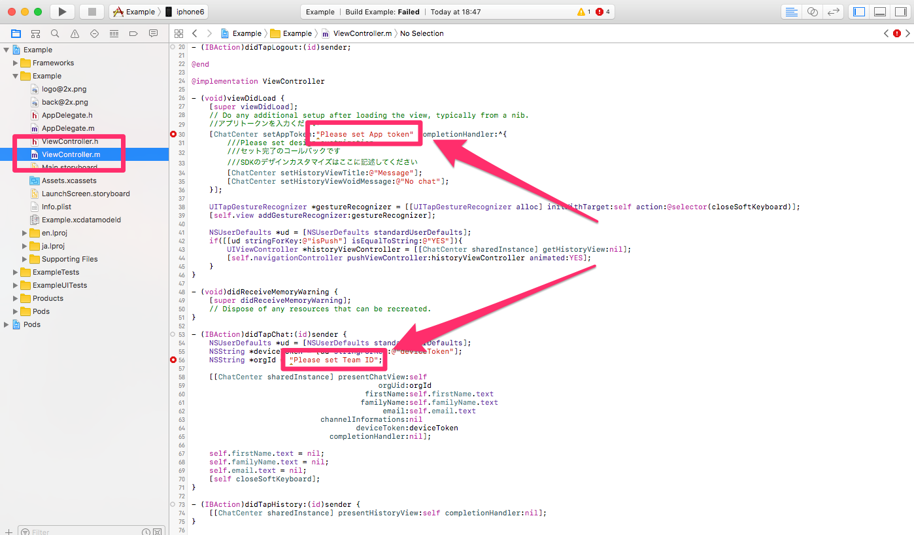
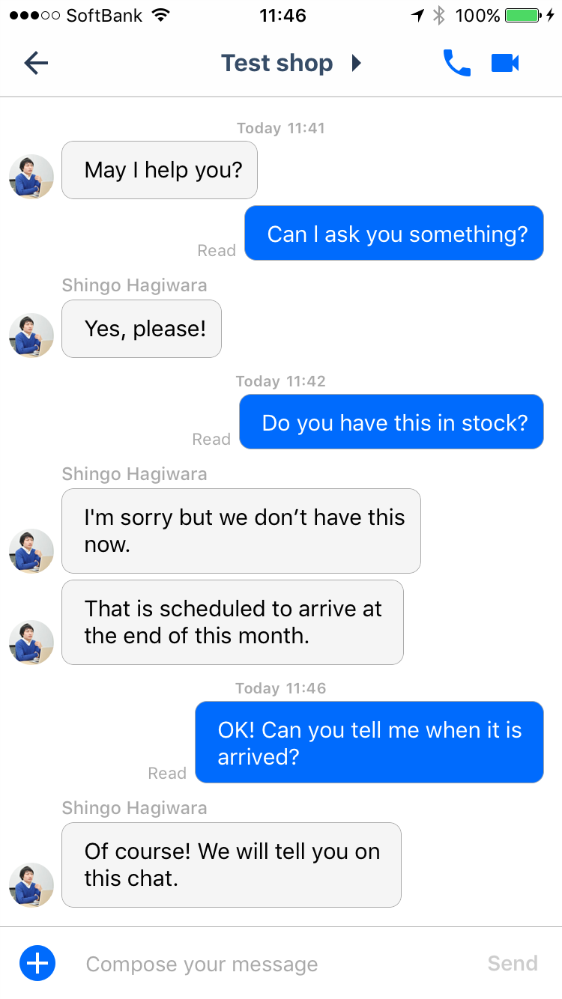
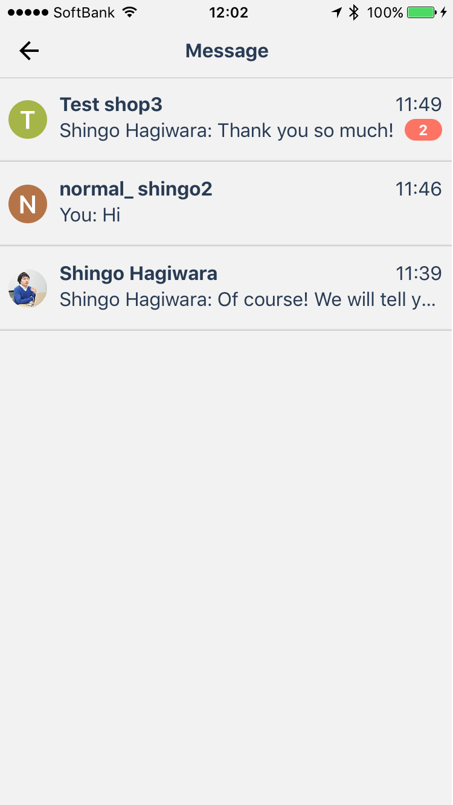

# ChatCenteriO iOS SDK Installation guide Ver. 1.0.8

## Table of contents
* [Getting Started](#GettingStarted)
	* [1. Download sample project](#DLSample)
	* [2. Pod install](#PodInstall)
	* [3. Set app org](#SetAppOrg)
	* [4. Launch app](#LaunchApp)
* [Install SDK in to your app](#InstallYourApp)
	* [1. Setting of Xcode](#SettingOfXcode)
	* [2. Set App Token](#SetAppToken)
    * [3. Display chat view](#DispalyChatView)
    * [4. Display history view](#DispalyHistoryView)
    * [5. Log out user](#LogoutUser)
* [Options](#Options)
    * [1. Push notification](#Pushnotification)
    * [2. Custom design](#DesignCustom)
    * [3. Confirm message](#ConfirmMessage)
    * [4. Get online / offline](#GetOnline/Offline)

<a id="GettingStarted"></a>
## Getting Started

<a id="DLSample"></a>
#### 1. Download sample project
You can download ChatCenter SDK from [here](https://github.com/chatcenter/ios/releases)
Example project is included.

<a id="PodInstall"></a>
#### 2. Pod install
Please execute pod install in the Example folder

<a id="SetAppOrg"></a>
#### 3. Set app org
<p align="center"></p>
Open the sample project and set app org in ViewController.m.
You can check the application token and team ID from the dashboard.

<a id="LaunchApp"></a>
#### 4. Launch app
<p align="center"></p>

<a id="InstallYourApp"></a>
## Install SDK into your app

<a id="SettingOfXcode"></a>
### 1. Setting of Xcode

<a id="1InstallSDK"></a>
#### 1-1. Installing SDK
Please choose one of the following methods (a) or (b).
#### (a)Install from Cocoa Pod
Please add the following to your Podfile (OpenTok is the library of voice / video chat used in ChatCenterSDK).
```
Ex)
target 'TargetName' do
pod 'ChatCenterSDK', :git => "https://github.com/chatcenter/ios.git"
pod 'OpenTok'
end
```

Please do pod install in the corresponding folder.
```
Ex)
pod install
```
#### (b)Install from source
**Download source**  
You can download ChatCenter SDK from [here](https://github.com/chatcenter/ios/releases)
  
Drag and drop the ChatCenterSDK folder to any folder.

**Add library**  
Please add the following library from "Build Phases"> "Link Binary With Libraries".

* UIKit.framework
* CoreGraphics.framework
* AudioToolbox.framework
* QuartzCore.framework
* CFNetwork.framework 
* Security.framework 
* Foundation.framework
* CoreData.framework
* SystemConfiguration.framework
* MobileCoreServices.framework
* libicucore.A.tbd or libicucore.dylib
* MapKit.framework
* AssetsLibrary.framework
* SafariServices.framework(Optional)  

**Add path to PCH file**  
Since there is a PCH file in ChatCenterSDK please go through the path.
As shown below, specify "Project (path below project) / ChatCenterSDK / ChatCenter.pch" in Project> Build Settings> Apple LLVM 7.0 - Language> Prefix Header.
<p align="center"></p>

**Add OpenTok library**  
OpenTok is a library of voice / video chats used within ChatCenterSDK.
Please add the following to your Podfile.

```
Ex)
target 'TargetName' do
pod 'OpenTok'
end
```

Please do pod install in the corresponding folder.

```
Ex)
pod install
```

***

<a id="4EditPlist"></a>
#### 1-2. Edit Plist
In some cases, ChatCenter SDK will use the user's information when sending each widget. Therefore, please change the setting to give plist permission to use the information.
Permission necessary are mentioned below.

| Permission necessary|Widgets that use the information| 
|:-----------|:------------|
| NSLocationWhenInUseUsageDescription|location information|
| NSPhotoLibraryUsageDescription|Image attachment|
| NSCameraUsageDescription|Image attachment/Video chat|
| NSMicrophoneUsageDescription|video chat/voice chat|

<p align="center"></p>
In the source, it will be shown as below.

```
Ex)
<key>NSLocationWhenInUseUsageDescription</key>
<string>Uses location information when sending</string>
<key>NSPhotoLibraryUsageDescription</key>
<string>Accesses to save image</string>
<key>NSCameraUsageDescription</key>
<string>Accesses to use for video chat</string>
<key>NSMicrophoneUsageDescription</key>
<string>Accesses to use for video chat</string>
```
***

<a id="5Localize"></a>
#### 1-3. Localization of languages
Please copy the string file to each lproj folder from the string file of each language we prepared. If the lproj folder does not exist, please copy the entire lproj folder.

```
Ex)
ja.lproj/ChatCenterSDK.strings
en.lproj/ChatCenterSDK.strings
```

<a id="SetAppToken"></a>
## 2. Set App Token
Please insert the following method into the viewDidLoad etc of the viewController at the first activate the app.  
```+ (void)setAppToken:(NSString *)appToken completionHandler:(void (^)(void))completionHandler;```

```
Ex)
#import "ChatCenter.h"

- (void)viewDidLoad
{
    [ChatCenter setAppToken:@”Issued by appsocially” completionHandler:^{
       ///call back for set completion

       ///Insert the SDK design customization here
    }];
  …
  …    
}
```
***

<a id="DispalyChatView"></a>
## 3. Display chat view
Call chat view to display chat.
<p align="center"></p>

### 3-1. When requiring authentication
Please insert the following code in a convenient place.

```
- (void)presentChatView:(UIViewController *)viewController
                 orgUid:(NSString *)orgUid
              firstName:(NSString *)firstName
             familyName:(NSString *)familyName
                  email:(NSString *)email
               provider:(NSString *)provider
          providerToken:(NSString *)providerToken
    providerTokenSecret:(NSString *)providerTokenSecret
   providerRefreshToken:(NSString *)providerRefreshToken
      providerCreatedAt:(NSDate *)providerCreatedAt
      providerExpiresAt:(NSDate *)providerExpiresAt
    channelInformations:(NSDictionary *)channelInformations
            deviceToken:(NSString *)deviceToken
      completionHandler:(void (^)(void))completionHandler;
```
PresentViewController a chat view with NavigationControlloer.
To add to existing NavigationControlloer, please use getChatView which returns standalone chat view.

The following are the parameters. Bold is mandatory. If other parameters are not required, please specify nil.
<table>
	<tr>
		<th>Parameter name</th>
		<th>Facebook</th>
		<th>Twitter</th>
	</tr>
	<tr>
		<td>viewController(UIViewController)</td>
		<td colspan="2"><b>Please specify the original ViewController to presentViewController</b></td>
	</tr>
	<tr>
		<td>orgUid(NSString)</td>
		<td colspan="2"><b>Please specify team ID based on Chat</b></td>
	</tr>
	<tr>
		<td>firstName(NSString)</td>
		<td colspan="2">Please specify the family name of the user to be generated. If nil is specified, the family name of the user registered on Facebook / Twitter will be used.</td>
	</tr>
	<tr>
		<td>familyName(NSString)</td>
		<td colspan="2">Please specify the last name of the user to be generated. If nil is specified, the family name of the user registered on Facebook / Twitter will be used.</td>
	</tr>
	<tr>
		<td>email(NSString)</td>
		<td colspan="2">Please specify the Email address of the user to be generated. If nil is specified, the Email address of the user registered on Facebook / Twitter will be used. (Need to request permission at Facebook authentication)。</td>
	</tr>
	<tr>
		<td>provider(NSString)</td>
		<td><b>@Please specify "facebook"</b></td>
		<td><b>@Please specify "twitter"</b></td>
	</tr>
	<tr>
		<td>providerToken(NSString)</td>
		<td colspan="2"><b>Please specify token of authentication result</b></td>
	</tr>
	<tr>
		<td>providerTokenSecret(NSString)</td>
		<td>Please specify nil</td>
		<td><b>Please specify Access token secret</b></td>
	</tr>
    <tr>
       <td>providerRefreshToken(NSString)</td>
       <td colspan="2">Please specify nil</td>
    </tr>
	<tr>
		<td>providerCreatedAt(NSDate)</td>
		<td colspan="2">Please specify nil</td>
	</tr>
	<tr>
		<td>providerExpiresAt(NSDate)</td>
		<td><b>Please specify the expiration date(expirationDate) of authentication</b></td>
		<td>Please specify nil</td>
	</tr>
	<tr>
		<td>deviceToken(NSString)</td>
		<td colspan="2">Please specify the deviceToken obtained from Apple for using Push notification</td>
	</tr>
	<tr>
		<td>channelInformations(NSDictionary)</td>
		<td colspan="2">Please specify url related to creating channel as below
``Ex) @{@"url":@"https://app.asana.com"}``</td>
	</tr>
	<tr>
		<td>completionHandler</td>
		<td colspan="2">Please specify which callback processing to call when closing chat view</td>
	</tr>
</table>


```
Ex)Facebook
#import "ChatCenter.h"

…

[[ChatCenter sharedInstance] presentChatView:self
                                      orgUid:orgUid
                                    provider:@”facebook”
                               providerToken:token.tokenString
                         providerTokenSecret:nil 
                        providerRefreshToken:nil
                           providerCreatedAt:nil
                           providerExpiresAt:token.expirationDate
                         channelInformations:@{@"url":@”http://xxxxxxx”}
                                 deviceToken:nil
                           completionHandler:nil];
                                              
…
```

```
Ex)Twitter
#import "ChatCenter.h"

…

[[ChatCenter sharedInstance] presentChatView:self
                                      orgUid:orgUid					
                                    provider:@”twitter”
                               providerToken:session.authToken
                         providerTokenSecret:session.authTokenSecret 
                        providerRefreshToken:nil
                           providerCreatedAt:nil
                           providerExpiresAt:nil
                         channelInformations:@{@"url":self.propertyUrl}
                                 deviceToken:nil	
                           completionHandler:nil];	              
…
```

### 3-2. When authentication is not required (Anonymous login)
**Note: In case of no authentication, user will be logged out automatically 30 days after login. Also, we do not currently support to link authentication processing afterwards**  
Please insert the following code in a convenient place.

```
- (void)presentChatView:(UIViewController *)viewController
                 orgUid:(NSString *)orgUid
              firstName:(NSString *)firstName
             familyName:(NSString *)familyName
                  email:(NSString *)email
    channelInformations:(NSDictionary *)channelInformations
            deviceToken:(NSString *)deviceToken
      completionHandler:(void (^)(void))completionHandler;
```

#### Parameter
The following are the parameters. Bold is mandatory. If other parameters are not required, please specify nil.
<table>
	<tr>
		<th>Name of parameter</th>
		<th>value</th>
	</tr>
	<tr>
		<td>viewController(UIViewController)</td>
		<td><b>Please specify the original ViewController to presentViewController</b></td>
	</tr>
	<tr>
		<td>orgUid(NSString)</td>
		<td><b>Please specify team ID based on Chat</b></td>
	</tr>
	<tr>
		<td>firstName(NSString)</td>
		<td>Please specify the first name of the user to be generated</td>
	</tr>
	<tr>
		<td>familyName(NSString)</td>
		<td>Please specify the last name of the user to be generated</td>
	</tr>
	<tr>
		<td>email(NSString)</td>
		<td>Please specify the Email address of the user to be generated</td>
	</tr>
	<tr>
		<td>channelInformations(NSDictionary)</td>
		<td>Please specify url related to creating channel as below)@{@"url":@"https://app.asana.com"}``</td>
	</tr>
	<tr>
		<td>completionHandler</td>
		<td>Please specify which callback processing to call when closing chat view</td>
	</tr>
</table>

```
Ex)
#import "ChatCenter.h"

…
[[ChatCenter sharedInstance] presentChatView:self
                                      orgUid:orgUid
                                   firstName:@”test-first”
                                  familyName:@”test-family”
                                       email:nil
                         channelInformations:@{@"url":self.propertyUrl}
                                 deviceToken:nil
                           completionHandler:nil];
…
```
***

<a id="DispalyHistoryView"></a>
## 4. Display history view
Call history view to display chat history list.  
<p align="center"></p>

### 4-1. When requiring authentication
Please insert the following code in a convenient place.

```
- (void)presentHistoryView:(UIViewController *)viewController
                  provider:(NSString *)provider
             providerToken:(NSString *)providerToken
       providerTokenSecret:(NSString *)providerTokenSecret 
    providerRefreshToken:(NSString *)providerRefreshToken
         providerCreatedAt:(NSDate *)providerCreatedAt
         providerExpiresAt:(NSDate *)providerExpiresAt
         completionHandler:(void (^)(void))completionHandler;
```
PresentViewController a Histroy View with NavigationControlloer.
To add to existing NavigationControlloer, please use getChatView which returns standalone chat view.

The following are the parameters. Bold is mandatory. If other parameters are not required, please specify nil.
<table>
	<tr>
		<th>Name of parameter</th>
		<th>Facebook</th>
		<th>Twitter</th>
	</tr>
	<tr>
		<td>viewController(UIViewController)</td>
		<td colspan="2"><b>Please specify the original ViewController to presentViewController</b></td>
	</tr>
	<tr>
		<td>provider(NSString)</td>
		<td><b>Please specify @"facebook"</b></td>
		<td><b>Please specify @"twitter"</b></td>
	</tr>
	<tr>
		<td>providerToken(NSString)</td>
		<td colspan="2"><b>Please specify token of authentication result</b></td>
	</tr>
	<tr>
		<td>providerTokenSecret(NSString)</td>
		<td>Please specify nil</td>
		<td><b>Please specify Access token secret</b></td>
	</tr>
    <tr>
        <td>providerRefreshToken(NSString)</td>
        <td colspan="2">Please specify nil</td>
    </tr>
	<tr>
		<td>providerCreatedAt(NSDate)</td>
		<td colspan="2">Please specify nil</td>
	</tr>
	<tr>
		<td>providerExpiresAt(NSDate)</td>
		<td><b>Please specify the expiration date(expirationDate) of authentication</b></td>
		<td>Please specify nil</td>
	</tr>
	<tr>
		<td>completionHandler</td>
		<td colspan="2">Please specify which callback processing to call when closing chat view</td>
	</tr>
</table>

```
Ex)Facebook
#import "ChatCenter.h"

…
[[ChatCenter sharedInstance] presentHistoryView:self
                                       provider:@"facebook"
                                  providerToken:token.tokenString 
                            providerTokenSecret:nil 
                           providerRefreshToken:nil
                              providerCreatedAt:nil 
                              providerExpiresAt:token.expirationDate
                              completionHandler:nil];
…
```

```
Ex)Twitter
#import "ChatCenter.h"

…
[[ChatCenter sharedInstance] presentHistoryView:self
                                       provider:@"twitter"
                                  providerToken:session.authToken 
                            providerTokenSecret:session.authTokenSecret 
                           providerRefreshToken:nil
                              providerCreatedAt:nil 
                              providerExpiresAt:nil
                              completionHandler:nil];
…
```

### 4-2. When authentication is not required (Anonymous login)
**Note: In case of no authentication, user will be logged out automatically 30 days after login. Also, we do not currently support to link authentication processing afterwards**  
Please insert the following code in a convenient place.


```
- (void)presentHistoryView:(UIViewController *)viewController
         completionHandler:(void (^)(void))completionHandler;
```

#### Parameter
The following are the parameters. Bold is mandatory. If other parameters are not required, please specify nil.
<table>
	<tr>
		<th>Name of parameter</th>
		<th>Value</th>
	</tr>
	<tr>
		<td>viewController(UIViewController)</td>
		<td><b>Please specify the original ViewController to presentViewController</b></td>
	</tr>
	<tr>
		<td>completionHandler</td>
		<td>Please specify which callback processing to call when closing chat view</td>
	</tr>
</table>

```
Ex)
#import "ChatCenter.h"

…
[[ChatCenter sharedInstance] presentHistoryView:self
                              completionHandler:nil];
…
```
***

<a id="LogoutUser"></a>
## 5. Log out user
In ChatCenter iOS SDK, chat data is saved in the local DB (Coredata), please reset the data by calling the following when logging out user.  
``- (BOOL)signOut;``
***


<a id="Options"></a>
## Options
<a id="Pushnotification"></a>
### 1. Push notification
**※ When using Push notification, please send the file and password on page 12 to our person in charge.**

#### 1-1. Turning on Push notification

#### (a)Set device token when displaying chat view
When calling chat view, set the device token acquired from Apple to deviceToken. Push notification is enabled at the time of registration.

#### (b)Set device token manually
Please call the following at the timing when you want to enable Push notification, such as sign in. Use it when you want to turn on Push notification before calling ChatCenter view.

```
- (void)signInDeviceToken:(NSString*)email
                 password:(NSString*)password
                 provider:(NSString *)provider
            providerToken:(NSString *)providerToken
      providerTokenSecret:(NSString *)providerTokenSecret 
     providerRefreshToken:(NSString *)providerRefreshToken
        providerCreatedAt:(NSDate *)providerCreatedAt
        providerExpiresAt:(NSDate *)providerExpiresAt
              deviceToken:(NSString *)deviceToken
        completionHandler:(void (^)(NSDictionary *result, NSError *error))completionHandler;
```

The following are the parameters. Bold is mandatory. If other parameters are not required, please specify nil.
<table>
<tr>
<th>Name of parameter</th>
<th>Facebook</th>
<th>Twitter</th>
</tr>
<tr>
<td>password(NSString)</td>
<td colspan="2">Please specify nil</td>
</tr>
<tr>
<td>email(NSString)</td>
<td colspan="2">Please specify nil</td>
</tr>
<tr>
<td>provider(NSString)</td>
<td><b>Please specify @"facebook"</b></td>
<td><b>Please specify @"twitter"</b></td>
</tr>
<tr>
<td>providerToken(NSString)</td>
<td colspan="2"><b>Please specify token of authentication result</b></td>
</tr>
<tr>
<td>providerTokenSecret(NSString)</td>
<td>Please specify nil</td>
<td><b>Please specify Access token secret</b></td>
</tr>
<tr>
<td>providerRefreshToken(NSString)</td>
<td colspan="2">Please specify nil</td>
</tr>
<tr>
<td>providerCreatedAt(NSDate)</td>
<td colspan="2">Please specify nil</td>
</tr>
<tr>
<td>providerExpiresAt(NSDate)</td>
<td><b>Please specify the expiration date(expirationDate) of authentication</b></td>
<td>Please specify nil</td>
</tr>
<tr>
<td>deviceToken(NSString)</td>
<td colspan="2"><b>Please specify the deviceToken obtained from Apple for using Push notification</b></td>
</tr>
<tr>
<td>channelInformations(NSDictionary)</td>
<td colspan="2">Please specify url related to creating channel as below ``Ex @{@"url":@"https://app.asana.com"}``</td>
</tr>
<tr>
<td>completionHandler</td>
<td colspan="2">Please specify call back processing after communication. Communication result is included</td>
</tr>
</table>

#### 1-2. Turning off Push notification
Please call the following at the timing when you want to invalidate Push notification, such as sign-out.

```
- (void)signOutDeviceToken:(NSString *)deviceToken
completionHandler:(void (^)(NSDictionary *result, NSError *error))completionHandler;
```

**Parameter**
The following are the parameters. Bold is mandatory. If other parameters are not required, please specify nil.
<table>
<tr>
<th>Name of parameter</th>
<th>Value</th>
</tr>
<tr>
<td>deviceToken(NSString)</td>
<td><b>Please specify the deviceToken obtained from Apple for using Push notification</b></td>
</tr>
<tr>
<td>completionHandler</td>
<td>Please specify call back processing after communication. Communication result is included</td>
</tr>
</table>

#### 1-3. Receiving Push notification
Please retrieve org_uid from the payload at reception and perform Display chat view.
The following payload will be sent.

```
{
"aps": {
"alert": "app_name You have a message from ChatCenter",
"badge": unread_count,
"sound": "default",
"category": "chat message",
"content-available": 1
},
"data": {
"org_uid": org_uid,
"channel_uid": channel_uid,
}
}
```

**Variable**

* app_name -> App name
* unread_count -> Number of unread channel
* org_uid -> Team ID(Company/Store ID)
* channel_uid -> Channel UID
***

<a id="DesignCustom"></a>
### 2. Custom design
Please set within setHandler of setAppToken

#### 2-1. Base color  
``+ (void)setBaseColor:(UIColor *)baseColor;``  
You can set the base color of the design. Mainly applied to;

* (Chat View) Background color of chat bubble sent by you
* (Chat View) Widget Menu Icon Colors
* (Chat View) Widget menu color


#### 2-2. headerBarStyle
``+ (void)setHeaderBarStyle:(UIBarStyle)headerBarStyle;``  
Set the BarStyle in the Chat / History view. By default UIBarStyleDefault is set.

#### 2-3. headerTranslucent
``+ (void)setHeaderTranslucent:(BOOL)headerTranslucent;``  
Set Translucent in the Chat / History view. By default, YES is set.

#### 2-4. headerItemColor
``+ (void)setHeaderItemColor:(UIColor *)headerItemColor;``  
Set TintColor for navigation items (title, voice / video chat icon, back / close button).

#### 2-5. headerBackgroundColor
``+ (void)setHeaderBackgroundColor:(UIColor *)headerBackgroundColor;``  
Sets the background color of the navigation.

#### 2-6. Close button image
``+ (void)setCloseBtnImage:(NSString *)normal hilighted:(NSString *)hilighted disable:(NSString *)disable;``  
Set the close button in the chat / history view.

#### 2-7. Back button image
``+ (void)setBackBtnImage:(NSString *)normal hilighted:(NSString *)hilighted disable:(NSString *)disable;``  
Set the back button in the chat / history view.

#### 2-8. Voice chat button image
``+ (void)setVoiceCallBtnImage:(NSString *)normal hilighted:(NSString *)hilighted disable:(NSString *)disable;``  
Sets the voice chat button in the chat view.

#### 2-9. Video chat button image
``+ (void)setVideoCallBtnImage:(NSString *)normal hilighted:(NSString *)hilighted disable:(NSString *)disable;``  
Sets the video chat button in the chat view.

#### 2-10. historyViewTitle
``+ (void)setHistoryViewTitle:(NSString *)historyViewTitle;``  
Set the wording of the title in the history view.

#### 2-11. historyViewVoidMessage
``+ (void)setHistoryViewVoidMessage:(NSString *)historyViewVoidMessage;``  
Set the wording to display when the chat is 0 in the history view.

```
Ex)
#import "ChatCenter.h"

…

- (void)viewDidLoad {
    [super viewDidLoad];
    [ChatCenter setAppToken:APP_TOKEN completionHandler:^{
        [ChatCenter setBaseColor:[UIColor blueColor]];
        [ChatCenter setHeaderBarStyle:UIBarStyleBlack];
        [ChatCenter setHeaderTranslucent:NO];
        [ChatCenter setHeaderItemColor:[UIColor blackColor]];
        [ChatCenter setHeaderBackgroundColor:[UIColor whiteColor]];
        [ChatCenter setCloseBtnImage:@"close.png" hilighted:@"close_pressed.png" disable:@"close_disable.png"];
        [ChatCenter setBackBtnImage:@"back.png" hilighted:@"back_pressed.png" disable:@"back_disable.png"];
        [ChatCenter setVoiceCallBtnImage:@"voice.png" hilighted:@"voice_pressed.png" disable:@"voice_disable.png"];
        [ChatCenter setVideoCallBtnImage:@"video.png" hilighted:@"video_pressed.png" disable:@"video_disable.png"];
        [ChatCenter setHistoryViewTitle:@"Message"];
        [ChatCenter setHistoryViewVoidMessage:@"No chat."];
    }];

…
```
***

<a id="ConfirmMessage"></a>
### 3. Confirm message
The following three types of API are prepared for displaying the number of unread counts.

<table>
<tr>
<th>API</th>
<th>Return Value</th>
<th>Details</th>
</tr>
<td>isUnreadMessageCount</td>
<td>BOOL</td>
<td>Returns the existence of unread messages</td>
</tr>
<tr>
<td>unreadMessageCount</td>
<td>NSUInteger</td>
<td>Return number of unread messages</td>
</tr>
<td>unreadChannelCount</td>
<td>NSUInteger</td>
<td>Return the number of unread chat rooms</td>
</tr>
</table>

```
Ex)
#import "ChatCenter.h"

…

if([[ChatCenter sharedInstance] isUnreadMessageCount] == YES){
   ///Unread message
}else{
   ///No unread message
}

…
```

#### When you want to load unread counts in advance
Normally, communication with ChatCenter occurs at the timing when chat view or history view is opened. 
If you want to load unread counts in advance, insert the following code after setAppToken is completed (within completionHandler).

#### (a)When requiring authentication
```
- (void)signInDeviceToken:(NSString*)email
                 password:(NSString*)password
                 provider:(NSString *)provider
            providerToken:(NSString *)providerToken
      providerTokenSecret:(NSString *)providerTokenSecret 
     providerRefreshToken:(NSString *)providerRefreshToken
        providerCreatedAt:(NSDate *)providerCreatedAt
        providerExpiresAt:(NSDate *)providerExpiresAt
              deviceToken:(NSString *)deviceToken
        completionHandler:(void (^)(NSDictionary *result, NSError *error))completionHandler;
```

The following are the parameters. Bold is mandatory. If other parameters are not required, please specify nil.
<table>
<tr>
<th>Name of parameter</th>
<th>Facebook</th>
<th>Twitter</th>
</tr>
<tr>
<td>password(NSString)</td>
<td colspan="2">Please specify nil</td>
</tr>
<tr>
<td>email(NSString)</td>
<td colspan="2">Please specify nil</td>
</tr>
<tr>
<td>provider(NSString)</td>
<td><b>Please specify @"facebook"</b></td>
<td><b>Please specify @"twitter"</b></td>
</tr>
<tr>
<td>providerToken(NSString)</td>
<td colspan="2"><b>Please specify token of authentication result</b></td>
</tr>
<tr>
<td>providerTokenSecret(NSString)</td>
<td>Please specify nil</td>
<td><b>Please specify Access token secret</b></td>
</tr>
<tr>
<td>providerRefreshToken(NSString)</td>
<td colspan="2">Please specify nil</td>
</tr>
<tr>
<td>providerCreatedAt(NSDate)</td>
<td colspan="2">Please specify nil</td>
</tr>
<tr>
<td>providerExpiresAt(NSDate)</td>
<td><b>Please specify the expiration date(expirationDate) of authentication</b></td>
<td>Please specify nil</td>
</tr>
<tr>
<td>deviceToken(NSString)</td>
<td colspan="2"><b>Please specify the deviceToken obtained from Apple for using Push notification</b></td>
</tr>
<tr>
<td>channelInformations(NSDictionary)</td>
<td colspan="2">Please specify url related to creating channel as below ``Ex @{@"url":@"https://app.asana.com"}``</td>
</tr>
<tr>
<td>completionHandler</td>
<td colspan="2">Please specify call back processing after communication. Communication result is included</td>
</tr>
</table>

#### (b)When authentication is not required
``- (void)signInWithAnonymous;``  
There’s no parameter.Parameter

```Ex
#import "ChatCenter.h"

…

- (void)viewDidLoad {
[super viewDidLoad];
[ChatCenter setAppToken:APP_TOKEN completionHandler:^{
…..    
…..

[[ChatCenter sharedInstance] signInWithAnonymous];
}];

}
…
```
***

<a id="GetOnline/Offline"></a>
### 4. Get online / offline
Please insert the following code in a convenient place.

``- (void)isOrgOnline:orgUid completeHandler:(void (^)(BOOL isOnline))completionHandler;``

Boldface is a required parameter. If other parameters are not required, please specify nil.
<table>
<tr>
<th>Name of parameter</th>
<th>Details</th>
</tr>
<tr>
<td><b>orgUid:(NSString *)</b></td>
<td><b>Please specify team ID you want to get online / offline</b></td>
</tr>
<tr>
<td>completeHandler</td>
<td>Please specify call back processing after communication. Communication result is included.</td>
</tr>
</table>

※If one or more agents belonging to the corresponding Org are online, YES is returned to isOnline of completionHandler.Otherwise NO will be returned.

```
Ex)
#import "ChatCenter.h"

…

[[ChatCenter sharedInstance] isOrgOnline:orgUid completeHandler:^(BOOL isOnline) {
        if (isOnline) {
            ///Org online
        }else{
            ///Org offline
        }
    }];

…
```
